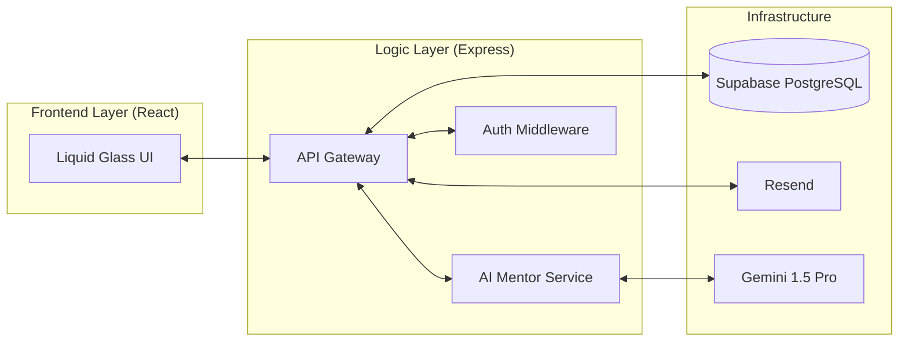
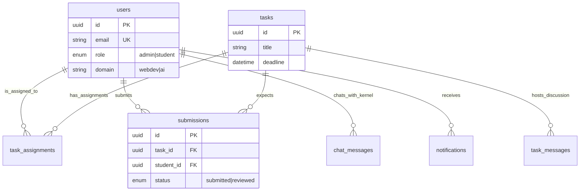

# ColdStart Backend — The Definitive Engineering Guide 🚀

This is the complete technical documentation for the ColdStart Backend API. It manages the core logic, AI integrations, database orchestration, and authentication protocols for the platform.

## 📐 System Architecture & High-Level Flow

ColdStart follows a **Controller-Route-Middleware** pattern, serving as the bridge between the React frontend, the Supabase PostgreSQL database, and the Gemini AI engine.

### Global Interaction Diagram


---

## 🗄️ Database Architecture (PostgreSQL / Supabase)

### 1. Entity Relationship Diagram (ERD)


### 2. Table Definitions
- **`users`**: Stores profiles; `id` matches Supabase Auth `sub`.
- **`tasks`**: Enshrines project requirements, deadlines, and design reference URLs.
- **`submissions`**: Tracks student GitHub URLs, lateness, and mentor feedback.
- **`task_messages`**: Power the private discussion threads per task.
- **`allowlist`**: Hard-gate for signup, ensuring only enrolled students can register.

---

## 📡 API Protocol & Endpoints Manifest

### Authentication & Authorization
All private routes require a **Supabase JWT** in the `Authorization: Bearer <token>` header.
- **`requireAuth`**: Verifies JWT via `jose` against Supabase JWKS.
- **`requireAdmin`**: Enforces role-based access control (RBAC).

### Exhaustive Endpoint List

| Module | Method | Path | Auth | Description |
| :--- | :--- | :--- | :--- | :--- |
| **Auth** | `POST` | `/api/auth/signup` | Public | Registers user via allowlist check. |
| **Tasks** | `GET` | `/api/tasks/my` | Student | Fetches tasks assigned to the student. |
| **Tasks** | `POST` | `/api/tasks` | Admin | Creates task + notifies students. |
| **Review**| `PATCH`| `/api/submissions/:id/review` | Admin | Posts feedback + triggers Email. |
| **Chat** | `POST` | `/api/chat` | User | Interactive AI mentorship (Kernel). |
| **Discussion**| `POST` | `/api/tasks/:id/messages` | User | Sends private thread message. |
| **Admin** | `GET` | `/api/admin/stats` | Admin | Aggregate dashboard statistics. |

---

## 🤖 Kernel: AI Mentor Engineering
Kernel utilizes **Google Gemini Pro 1.5** with recursive context injection.

### AI Lifecycle Flow
1. **Request**: Student sends a message.
2. **Context Injection**: Backend fetches user metadata, assigned task descriptions, and current platform announcements.
3. **Prompting**: Combines context with a high-fidelity "Mentor Persona" system prompt.
4. **Memory Management**: Summarizes the last 10 messages into `users.chat_summary` every 10 turns to maintain context integrity and efficiency.

---

## 🚀 Environment & Deployment

### Environment Variables (.env)
```env
PORT=4000
SUPABASE_URL=...
SUPABASE_SERVICE_ROLE_KEY=...
GEMINI_API_KEY_1=...  # Supports up to 4 keys for rotation
RESEND_API_KEY=...    # For feedback emails
```

### Setup & Local Execution
1. **Install**: `npm install`
2. **Dev**: `npm run dev` (Nodemon-based)
3. **Production**: Optimized for Vercel Serverless Functions.

---
*ColdStart Backend — Powering the future of developer mentorship.*
